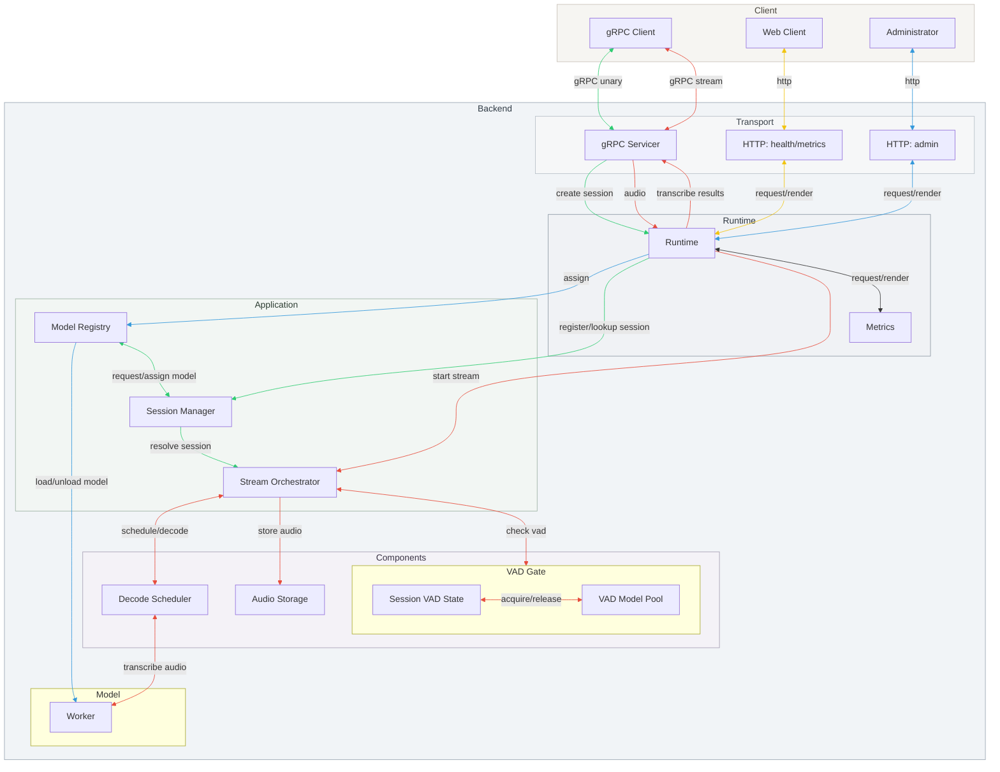
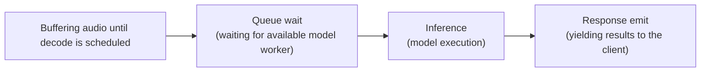

# Whisper Streaming STT Server

Whisper Streaming STT Server is a gRPC service that performs low-latency speech to text with VAD-based endpointing, streaming partial/final results as audio arrives.

## Quickstart

PyAV (a transitive dependency of `faster-whisper`) requires `pkg-config` so it can find FFmpeg headers during installation. Install the system packages first, then run `pip install -r requirements.txt`.

### macOS

```bash
brew install pkg-config ffmpeg
```

> **Note:** PyAV 11.x (required by `faster-whisper==0.10.0`) is not compatible
> with FFmpeg 7/8 headers yet; build failures usually mention
> `AV_OPT_TYPE_CHANNEL_LAYOUT`. Install FFmpeg 6 instead:
>
> ```bash
> brew uninstall --ignore-dependencies ffmpeg
> brew install ffmpeg@6
> brew link --overwrite --force ffmpeg@6
> ```

### Debian/Ubuntu

```bash
sudo apt update
sudo apt install pkg-config ffmpeg libavformat-dev libavcodec-dev libavdevice-dev
```

## Usage / Examples

1. Install dependencies (after the system packages above):
   ```bash
   python -m venv .venv
   source .venv/bin/activate
   python -m pip install -r requirements.txt
   ```
   Optional (for CLI entrypoints like `stt-server`): `pip install -e .`
2. Start the gRPC server (run from the repo root so `gen` is on `PYTHONPATH`):

```bash
python -m stt_server.main --log-metrics
```

- `--model`, `--model-backend`, `--device`, `--compute-type`, `--language`, `--model-pool-size`, and `--port` let you customize the Whisper backend and networking.
- `--max-sessions` controls how many client streams the server accepts in parallel.
- `--log-metrics` prints decode latency + real-time factor for each decode run.
- `--config <path>` points to the server YAML (default: `config/server.yaml`).
- `--model-config <path>` points to the model/decode YAML (default: `config/model.yaml`).
- `--log-level` / `--log-file` override the logging section (console/file).
- `--faster-whisper-log-level` overrides the `faster_whisper` logger level (default WARNING).
- `--tls-cert-file` / `--tls-key-file` enable gRPC TLS with a server cert + key.
- `--tls-required` enforces TLS (server refuses to start without cert/key).
- `--vad-silence` / `--vad-threshold` configure the VAD gate (silence duration + Silero VAD probability threshold, 0-1) that triggers final decoding.
- `--speech-threshold` sets the minimum RMS required before buffering is treated as speech (helps ignore low-level noise).
- `--decode-timeout` specifies the wait time for outstanding decode tasks during draining (<=0 waits indefinitely).
- `--metrics-port` sets the FastAPI metrics/health server port (default 8000).
- `--grpc-worker-threads` controls the gRPC thread pool size (0/unset = auto).
- `--require-api-key` enforces api_key on CreateSession (server-side auth gate).
- Sessions auto-disconnect after 60 seconds of silence; adjust `server.session_timeout_sec` in `config/server.yaml` (or set your own config file).

If you want TLS on the server, pass cert/key paths:

```bash
python -m stt_server.main \
  --tls-cert-file /path/to/cert.pem \
  --tls-key-file /path/to/key.pem
```

3. In another terminal, run the sample **realtime file** client:

   ```bash
   python -m stt_client.realtime.file -c stt_client/config/file.yaml --metrics
   ```

   - `-c/--config` loads YAML defaults (e.g., `audio_path`, `decode_profile`, VAD settings). CLI flags override.
   - Add `--no-realtime` to send audio as fast as possible (for throughput tests).
   - Use `--server host:port` or `--chunk-ms value` to tweak target and chunking.
   - Use `--vad-mode auto` to enable auto-end sessions (default is `continue`).
   - Override the detector per session via `--vad-silence` (seconds) and `--vad-threshold` (VAD probability).
   - Use `--language ja`, `--task translate`, or `--decode-profile accurate` to override the server defaults per session.
   - `--attr key=value` (repeatable) attaches arbitrary attributes, and
     `--require-token` asks the server to issue/validate per-session tokens.
   - Use `--tls` for system-trusted certs, or `--tls-ca-file /path/to/cert.pem` for self-signed.

4. To stream live audio from a macOS microphone (requires microphone permission):

   ```bash
   python -m stt_client.realtime.mic -c stt_client/config/mic.yaml --metrics
   ```

   - Defaults to `--vad-mode continue`; use `auto` to end sessions once speech stops.
   - Per-session overrides: `--vad-silence` (seconds) and `--vad-threshold` (VAD probability) mirror the server flags.
   - Same `--language`, `--task`, `--decode-profile`, `--require-token`, and attributes semantics apply.
   - Optional flags: `--device` (CoreAudio name/index), `--sample-rate`, `--chunk-ms`.
   - TLS: add `--tls` or `--tls-ca-file /path/to/cert.pem`.

5. For batch-style processing (single large chunk, ideal for accuracy-oriented profiles):

   ```bash
   python -m stt_client.batch.file -c stt_client/config/file.yaml --decode-profile accurate
   ```

   - Defaults to the `accurate` profile; override with `--decode-profile realtime`.
   - Accepts the same `--language`, `--task`, attributes, token, and `--vad-*` flags as the realtime clients.
   - Batch ignores `chunk_ms`/`realtime` fields in the config; it always sends a single chunk.
   - TLS: add `--tls` or `--tls-ca-file /path/to/cert.pem`.

## Configuration

Runtime defaults live in two files:

- `config/server.yaml`: networking, session limits, logging, and VAD controls.
- `config/model.yaml`: Whisper model/device settings plus the named decode profiles.

Sample client configs live in:

- `stt_client/config/file.yaml`: file + batch client defaults (audio path, session options).
- `stt_client/config/mic.yaml`: mic client defaults (device, sample rate, session options).

Copy/edit the server YAMLs (or point `--config` / `--model-config` at your own YAML) to change server behavior. Client YAMLs are loaded via `-c/--config`. Example server snippet (`config/server.yaml`):

```yaml
server:
  port: 50051 # gRPC listen port
  http_host: "127.0.0.1" # HTTP metrics/health bind host
  max_sessions: 4 # Concurrent gRPC sessions
  metrics_port: 8000 # HTTP metrics/health port
  decode_timeout_sec: 30 # Wait time for pending decodes during drain
  log_metrics: false # Emit decode metrics logs
  session_timeout_sec: 60 # Seconds of inactivity before aborting a session
  max_buffer_sec: 20 # Max buffered audio seconds before partial decode/trim (null disables)
  max_buffer_bytes: null # Max buffered audio bytes before partial decode/trim (null disables)
  max_chunk_ms: 2000 # Max single chunk duration in milliseconds (null disables)
  partial_decode_interval_sec: 1.5 # Partial decode interval during speech (null disables)
  partial_decode_window_sec: 10.0 # Window size for partial decode audio (seconds)
  max_pending_decodes_per_stream: 8 # Max queued decodes per stream before dropping partials
  max_pending_decodes_global: 64 # Global max queued decodes before backpressure/drop
  max_total_buffer_bytes: 67108864 # Global buffered audio cap (bytes)
  decode_queue_timeout_sec: 1.0 # Seconds to wait for a global decode slot (final only)
  buffer_overlap_sec: 0.5 # Overlap window retained after partial decode (seconds)
  grpc_max_receive_message_bytes: 8388608 # Max gRPC inbound message size
  grpc_max_send_message_bytes: 4194304 # Max gRPC outbound message size
  sample_rate: 16000 # Fallback sample rate when chunks omit it

vad:
  silence: 0.5 # Seconds of trailing silence to trigger decode
  threshold: 0.5 # Silero VAD speech probability threshold (0-1)
  model_pool_size: 4 # VAD model pool size (0 uses max_sessions)
  model_prewarm: 1 # Prewarm VAD models on startup
  model_pool_growth_factor: 1.5 # VAD pool growth factor on demand

safety:
  speech_rms_threshold: 0.00 # Minimum RMS required before decoding buffered audio

logging:
  level: "INFO"
  file: null
  faster_whisper_level: null # Optional override (default WARNING when unset)
  log_transcripts: false # Log transcript text in decode logs (PII risk)

tls:
  cert_file: null # Path to TLS cert chain (enables gRPC TLS)
  key_file: null # Path to TLS private key (enables gRPC TLS)
  required: false # Require TLS; refuse to start without cert/key

metrics:
  expose_api_key_sessions: false # Include active_sessions_by_api in /metrics payload

auth:
  require_api_key: false # Require api_key attribute on CreateSession

storage:
  persist_audio: false
  directory: "data/audio"
  queue_max_chunks: 256 # Max queued PCM chunks before dropping oldest
  max_bytes: null # Optional byte cap
  max_files: null # Optional file-count cap
  max_age_days: null # Optional retention window

health:
  window_sec: 60 # Rolling window for decode health aggregation
  min_events: 5 # Minimum events before evaluating health ratios
  max_timeout_ratio: 0.5 # Degraded when decode timeouts exceed this ratio
  min_success_ratio: 0.5 # Degraded when successful decodes fall below this ratio
```

Example model snippet (`config/model.yaml`):

```yaml
model:
  name: "small" # Whisper model size
  backend: "faster_whisper" # faster_whisper | torch_whisper
  device: "cpu" # cpu / cuda / mps (torch_whisper)
  compute_type: "int8" # backend compute type
  pool_size: 1 # Number of preloaded model instances
  language_fix: false # Force the configured language when true
  language: "ko" # e.g., de, en, fr, ja, ko, zh ... (auto-detect when unset and language_fix=false)
  task: "transcribe" # "transcribe" | "translate"
  default_decode_profile: "realtime" # Name from decode_profiles

decode_profiles: # Named decode options (unknown keys return ERR1010)
  realtime:
    beam_size: 1 # Beam width
    best_of: 1 # Number of candidates to sample
    patience: 1.0 # Beam search patience
    temperature: 0.0 # Sampling temperature
    length_penalty: 1.0 # Length penalty
    without_timestamps: true # Disable timestamps in output
    compression_ratio_threshold: 2.4 # Repetition filter threshold
    no_speech_threshold: 0.6 # Silence detection threshold
    log_prob_threshold: -1.0 # Low-probability rejection threshold (-1.0 disables)
  accurate:
    beam_size: 5 # Beam width
    best_of: 5 # Number of candidates to sample
    patience: 1.0 # Beam search patience
    temperature: 0.0 # Sampling temperature
    length_penalty: 1.0 # Length penalty
    without_timestamps: true # Disable timestamps in output
    compression_ratio_threshold: 2.4 # Repetition filter threshold
    no_speech_threshold: 0.6 # Silence detection threshold
    log_prob_threshold: -1.0 # Low-probability rejection threshold (-1.0 disables)
```

Decode options are validated against a whitelist; unknown keys return `ERR1010`.

CLI flags always override YAML entries if provided.

**Model backend selection**

- `faster_whisper` (default): fastest on CPU/CUDA with CTranslate2.
- `torch_whisper`: PyTorch Whisper backend (supports `mps` on macOS).
- Clients choose among preloaded model variants using `model_id` (e.g., `cpu-small`, `mps-small`).
  Backend/device selection is controlled by the server via model profiles or admin load.
  On Apple Silicon, `torch_whisper` with `device: mps` can outperform CPU `faster_whisper`
  in end-to-end throughput; verify on your hardware with the load-test tool.
  Example: `python -m tools.bench.grpc_load_test --channels 30 --realtime`.

**Observability security**

- The HTTP metrics/health server binds to `server.http_host` (default `127.0.0.1`).
- Set `STT_OBSERVABILITY_TOKEN` to require `Authorization: Bearer <token>` for
  `/metrics`, `/metrics.json`, `/system`, and `/health`.
- Optional public health: set `STT_PUBLIC_HEALTH=minimal` to allow `/health` without a token,
  returning only `{status}` with HTTP 200/503. Supplying the observability token still returns
  full details.
- Optional strict health details: set `STT_HEALTH_DETAIL_MODE=token` to always require the
  observability token for detailed `/health` responses. Without a token, only `{status}` is returned.
- Optional IP allowlist: `STT_HTTP_ALLOWLIST` (comma-separated CIDR blocks, e.g. `10.0.0.0/8,127.0.0.1/32`).
- Trusted proxy list for `X-Forwarded-For`: `STT_HTTP_TRUSTED_PROXIES` (comma-separated CIDR blocks or hostnames).
  The server only trusts `X-Forwarded-For` when the direct client IP matches this list; otherwise it uses the socket IP.
- Optional rate limiting: `server.http_rate_limit_rps` and
  `server.http_rate_limit_burst` (config file). Env overrides are still supported
  via `STT_HTTP_RATE_LIMIT_RPS` / `STT_HTTP_RATE_LIMIT_BURST`.
  The rate limiter keys off the same client IP used for allowlist checks, so set
  `STT_HTTP_TRUSTED_PROXIES` when running behind a proxy that terminates HTTP.
  Limiter state is bounded with TTL/LRU pruning to avoid unbounded key growth.
  Cleanup runs at least every 1000 allow() calls in addition to time-based pruning.

**Operations/Capacity**

- `model.languages`: languages to force during decoding (repeat to weight; `null`/omit enables auto-detect).
- `model.pool_size`: number of Whisper model instances to preload.
- `server.max_sessions`: concurrent gRPC stream cap.
- `server.create_session_rps` / `server.create_session_burst`: CreateSession rate limiter (per api_key or client IP).
- `server.max_sessions_per_ip` / `server.max_sessions_per_api_key`: per-identity concurrent session caps.
- `server.max_audio_seconds_per_session`: hard cap on total streamed audio seconds per session.
- `server.max_audio_bytes_per_sec` / `server.max_audio_bytes_per_sec_burst`: inbound audio byte rate limiter (per api_key or client IP).
- `vad.model_pool_size` / `vad.model_prewarm`: VAD pool size/prewarm (`model_pool_size=0` uses `server.max_sessions`).
- `vad.model_pool_growth_factor`: pool growth factor on VAD demand spikes (up to `server.max_sessions`), beyond that rejects with `ERR1008`.

Suggested production defaults (tune per traffic profile):

- `server.create_session_rps`: 2-5, burst 2x
- `server.max_sessions_per_ip`: 2-4
- `server.max_sessions_per_api_key`: 4-8
- `server.max_audio_seconds_per_session`: 120-300
- `server.max_audio_bytes_per_sec`: `sample_rate * 2` (e.g., 32000 for 16k PCM), burst 2x

**Buffer**

- `server.max_buffer_sec` / `server.max_buffer_bytes`: per-session buffer cap. When reached, Continue schedules a partial decode and keeps `server.buffer_overlap_sec`, while Auto-End keeps only the newest window.
- `server.partial_decode_interval_sec`: partial decode cadence during speech.
- `server.partial_decode_window_sec`: audio window length sent to partial decode.
- `server.max_total_buffer_bytes`: total buffered bytes across all sessions.

**Decode/Backpressure**

- `server.decode_timeout_sec`: max wait while draining decodes (<= 0 means wait forever).
- `server.max_pending_decodes_per_stream`: per-stream pending cap.
- `server.max_pending_decodes_global`: global pending cap (finals apply backpressure, partials drop).
- `server.decode_queue_timeout_sec`: time to wait for a global slot (final results).
- `server.max_chunk_ms`: max single audio chunk duration.
- `server.grpc_max_receive_message_bytes` / `server.grpc_max_send_message_bytes`: gRPC message size caps.

**Security/Visibility**

- `metrics.expose_api_key_sessions`: whether `/metrics` includes `active_sessions_by_api` (may be sensitive).

**Storage**

- `storage.queue_max_chunks`: audio storage queue cap (drops oldest when full).

**Health**

- `health.*`: thresholds for recent success/timeout ratios in `/health`.

**Safety**

- `safety.speech_rms_threshold`: skip decode when RMS is too low.

Each client first calls `CreateSession`:

## Log/PII policy

- Transcript text is **never** written to the main log stream by default.
- To log transcripts, you must opt in with **both**:
  - `logging.log_transcripts: true`
  - `logging.transcript_file: /path/to/transcripts.log`
- Transcript logs are written to a dedicated sink with short retention (`logging.transcript_retention_days`, default 7).
- Protect transcript logs with RBAC and audit controls in your logging pipeline.

- Pass an application-defined `session_id` plus optional `--attr KEY=VALUE` pairs (custom session attributes; `--meta` remains a CLI alias).
- Choose **VAD Continue** (default) or **VAD Auto-End** via `--vad-mode`; auto-end ends the session on silence, continue keeps it open for multi-utterance workloads.
- Set `--attr api_key_required=true` to require API keys, and pass `--attr api_key=...` to supply one.
- Use `--require-token` to have the server issue a per-session token that must be attached to every audio chunk for light-weight validation.
- Sessions are cleaned up automatically when the streaming RPC ends.

## Architecture

**Client flow**

- Open a gRPC channel and call `CreateSession` to resolve session settings.
- Use bidirectional `StreamingRecognize` to send PCM chunks and receive partial/final transcripts.
- The server resolves the session, gates audio with VAD, schedules decodes, and optionally persists audio.
- Session teardown handles cleanup and retention.

**Server architecture**

- The gRPC servicer is the transport entrypoint and delegates session creation + streaming to the runtime.
- The runtime wires the session manager, model registry, and stream orchestrator.
- The orchestrator drives VAD, decode scheduling, and optional audio storage.
- The HTTP server exposes `/health`, `/metrics` (Prometheus), `/metrics.json` (JSON), and an admin control plane for model load/unload/list.



## Observability/Operations

The server also exposes an HTTP control plane (default `0.0.0.0:8000`) serving:

- `GET /metrics`: Prometheus text exposition (flattened counters/gauges).
- `GET /metrics.json`: JSON counters/gauges (active sessions, API-key session counts, decode timing aggregates, RTF stats, VAD trigger totals, active VAD utterances, error counts).
- `GET /health`: returns `200` when the gRPC server is running, Whisper models are loaded, and worker pools are healthy; otherwise `500`.
- `GET /system`: JSON process/system metrics (CPU, RAM, thread counts). Uses `psutil` when available; otherwise falls back to basic RSS info. Optional GPU metrics can be enabled with `STT_ENABLE_GPU_METRICS=1` when `pynvml` is installed.

Security checks:

- `tools/security_smoke_check.sh http://<host>:<port>` verifies `/metrics*`, `/system`, `/health` are protected (or `/health` is minimal when `STT_PUBLIC_HEALTH=minimal`).
- `tools/check_tls_expiry.py /path/to/cert.pem --warn-days 14` fails when certificates near expiry.

### Terminal dashboard (optional)

Use the terminal dashboard to poll `/metrics.json` and `/system` on a fixed interval:

```bash
python -m tools.dashboard.monitor_dashboard
```

Common options:

- `--metrics-url` / `--system-url` to target a remote server.
- `--interval` to control refresh cadence (seconds).
- `--once` to fetch a single snapshot.
- `--no-clear` to avoid clearing the terminal between updates.

### Decode timing breakdown

Decode timing is measured inside the server for every decode task. The timing is split into distinct phases so you can see where time is being spent:

- **buffer wait time**: time spent accumulating audio before the decode is scheduled
- **queue wait time**: time spent waiting for an available model worker after the decode is scheduled
- **inference time**: time spent executing the model
- **response emit time**: time spent yielding results back to the client
- **total decode time**: sum of buffer wait + queue wait + inference + response emit



These totals are attached to each `StreamingRecognize` call as trailing metadata:

- `stt-decode-buffer-wait-sec`
- `stt-decode-queue-wait-sec`
- `stt-decode-inference-sec`
- `stt-decode-response-emit-sec`
- `stt-decode-total-sec`
- `stt-decode-count`

The `sec` suffix means seconds. Bench session logs print the same values per stream to help correlate client-observed latency with server-side decode timing.

### Docker

Dockerfiles live in the `docker/` directory (Ubuntu 22.04).

Build:

```bash
docker build -f docker/Dockerfile.ubuntu -t whisper-stt-server:ubuntu .
```

Run:

```bash
docker run --rm -p 50051:50051 -p 8000:8000 whisper-stt-server:ubuntu
```

#### Kubernetes

Apply manifests (ConfigMap, Deployment, Service):

```bash
kubectl apply -f k8s/configmap.yaml
kubectl apply -f k8s/deployment.yaml
kubectl apply -f k8s/service.yaml
```

NodePort access (on-premises):

```bash
kubectl get nodes -o wide

# Use the Internal-IP value from `kubectl get nodes -o wide` for <node-internal-ip>.
python -m stt_client.realtime.mic --server <node-internal-ip>:32051
```

Update config and rollout:

```bash
kubectl apply -f k8s/configmap.yaml
kubectl rollout restart deployment/stt-server
```

### Server-side audio capture

Enable `storage.persist_audio: true` to have the backend archive one WAV file per session inside `storage.directory`. Audio chunks are queued to a background writer thread to avoid blocking the streaming loop. Retention is enforced lazily right after each session finishes:

- `max_bytes`: cap total on-disk bytes (oldest files removed first).
- `max_files`: keep at most _N_ WAV files (oldest deleted first).
- `max_age_days`: delete recordings older than _N_ days.

Leave any limit `null` or negative for “no limit”. Audio capture is disabled by default and only activates when configured, so deployments that do not need server-side logging incur no overhead.

## Admin/Control Plane

The server provides an HTTP-based admin control plane for **runtime model management**.
These endpoints allow operators to manage Whisper models without restarting the gRPC server.

### Endpoints

- `POST /admin/load_model`
  Loads a Whisper model into the runtime. This can be used to pre-warm models or dynamically add new model variants.
  Prefer `profile_id` to select a pre-defined load profile from `model_load_profiles` in `config/model.yaml`.
  If no profile is provided and no legacy overrides are sent, the default profile is used.
  `backend` may be specified to select `faster_whisper` or `torch_whisper`.

- `POST /admin/unload_model`
  Unloads a previously loaded model to free CPU/GPU memory. Active sessions using the model must complete or fail gracefully.

- `GET /admin/list_models`
  Returns the list of currently loaded models and their runtime status.

- `GET /admin/load_model_status?model_id=...`
  Returns load job status (`queued`, `running`, `success`, `failed`) and error info when available.

#### Load model (profile-based)

Define profiles in `config/model.yaml`:

```yaml
model:
  default_model_load_profile: "default"

model_load_profiles:
  default:
    model_size: "small"
    backend: "faster_whisper"
    device: "cpu"
    compute_type: "int8"
    pool_size: 1
```

Then load by profile:

```bash
curl -X POST "http://localhost:8000/admin/load_model" \
  -H "Authorization: Bearer $STT_ADMIN_TOKEN" \
  -H "Content-Type: application/json" \
  -d '{"model_id":"small-rt","profile_id":"default"}'
```

**Note:** Admin endpoints are intended for operator use only and should be protected or restricted in production environments.

### Admin API security (recommended)

Admin endpoints are **disabled by default**. To enable them, set:

- `STT_ADMIN_ENABLED=true`
- `STT_ADMIN_TOKEN=<token>`

Requests must include an `Authorization: Bearer <token>` header.
Do not rely on IP allowlists alone; treat the admin plane as Internet-facing unless explicitly
firewalled/isolated.

To restrict model loading via `model_path`, set:

- `STT_ADMIN_ALLOW_MODEL_PATH=true` to allow `model_path`
- `STT_ADMIN_MODEL_PATH_ALLOWLIST` (comma-separated prefixes) to whitelist paths/IDs
  - Examples: `/models/`, `openai/`

## API Stability Contract

Changes to public APIs must be **additive**. The rules below are enforced by tests
(`tests/test_api_contract.py`) and the golden contract files in `tests/compat/`.
Include API/compat notes in release tags to make contract impact explicit.

### gRPC/proto rules

- **Additive only**: adding new fields/messages is allowed.
- **No removals/renames**: existing fields/messages must remain.
- **No type/label changes**: field type and cardinality (`optional`, `repeated`, `map`) are frozen.
- **No number reuse**: field numbers are immutable; do not reuse removed numbers.
- **Document meaning/units** for any new field or enum value in `proto/stt.proto`.

### HTTP schema rules

- **Additive only**: response payloads may add new fields, but must not remove or change types.
- **Stable error format**: HTTP errors always return `{code, message}`.
- **Stable status mapping**: timeout/overload/auth/permission/invalid-input mappings are fixed
  (see `tests/compat/error_code_contract.json`).

### Compatibility tests

- `tests/compat/stt_proto_contract.json` captures existing proto fields and numbers.
- `tests/compat/error_code_contract.json` pins key error/status mappings.

## Troubleshooting

### Error codes

Errors are tagged in logs and gRPC error messages with `ERR####`. HTTP endpoints (admin/control plane) return a JSON payload with `code` and `message` when they fail. The gRPC status codes are listed below for clarity.

#### `ERR1xxx`: request/session validation or authentication failures

- `ERR1001` (INVALID_ARGUMENT): missing `session_id` in `CreateSession`
- `ERR1002` (ALREADY_EXISTS): `session_id` already active
- `ERR1003` (INVALID_ARGUMENT): `vad_threshold` must be non-negative
- `ERR1004` (UNAUTHENTICATED): unknown or missing `session_id`
- `ERR1005` (PERMISSION_DENIED): invalid session token
- `ERR1006` (DEADLINE_EXCEEDED): session timeout (no audio)
- `ERR1007` (INVALID_ARGUMENT): audio chunk exceeds maximum size
- `ERR1008` (RESOURCE_EXHAUSTED): VAD capacity exhausted
- `ERR1009` (UNAUTHENTICATED): API key required but missing
- `ERR1010` (INVALID_ARGUMENT): invalid decode option(s)
- `ERR1011` (RESOURCE_EXHAUSTED): session limit exceeded
- `ERR1012` (RESOURCE_EXHAUSTED): CreateSession rate limited
- `ERR1013` (UNAVAILABLE): server shutting down

#### `ERR2xxx`: decode pipeline/runtime failures

- `ERR2001` (DEADLINE_EXCEEDED): decode timeout waiting for pending tasks
- `ERR2002` (INTERNAL): decode task failed
- `ERR2003` (RESOURCE_EXHAUSTED): stream rate limit exceeded
- `ERR2004` (RESOURCE_EXHAUSTED): stream audio limit exceeded

#### `ERR3xxx`: unexpected server exceptions

- `ERR3001` (UNKNOWN): unexpected `CreateSession` error
- `ERR3002` (UNKNOWN): unexpected `StreamingRecognize` error

#### `ERR4xxx`: admin/control-plane HTTP failures

- `ERR4001` (HTTP 501): admin API not enabled
- `ERR4002` (HTTP 409): model already loaded
- `ERR4003` (HTTP 400): model not found or is default (unload failed)
- `ERR4004` (HTTP 401): invalid or missing admin token
- `ERR4005` (HTTP 403): `model_path` not allowed
- `ERR4009` (HTTP 400): unknown model load profile

## Development

### SLO/Performance

See `docs/slo.md` for draft targets and a load-test report template.

### Tests

- Unit tests only (skip integration): `./tools/run_tests.sh unit`
- Integration tests (requires running server): `./tools/run_tests.sh integration`
- Abuse/load smoke tests (starts temp server): `./tools/run_tests.sh abuse`
- Full test run: `./tools/run_tests.sh all`

### Long-run abuse/profiling

Manual helper for longer-running noise/silence streams (RSS/threads delta summary):

```bash
python3 tools/long_run_abuse.py --server localhost:50051 --http http://localhost:8000 \\
  --duration-sec 600 --mode noise --token "$STT_OBSERVABILITY_TOKEN"
```

### Generate gRPC stubs

Create a versioned package structure (e.g. `gen/stt/python/v1`) so both the server and client can import the same generated stubs:

```bash
mkdir -p gen/stt/python/v1
touch gen/__init__.py
touch gen/stt/__init__.py
touch gen/stt/python/__init__.py
touch gen/stt/python/v1/__init__.py

python -m grpc_tools.protoc \
  -I proto \
  --python_out=gen/stt/python/v1 \
  --grpc_python_out=gen/stt/python/v1 \
  --mypy_out=./gen/stt/python/v1 \
  proto/stt.proto
```

Commit/publish the `gen` package (or copy it into each project) so both
sides share the same `stt_pb2.py` and `stt_pb2_grpc.py` files.

### Load testing (bench)

Run the gRPC load-test script from the repo root:

```bash
python -m tools.bench.grpc_load_test --channels 100 --iterations 1 --warmup-iterations 1 --log-sessions
```

Per-session logs can be emitted in structured formats:

- `--session-log-format` supports `jsonl` (default), `csv`, `tsv`, and `markdown`.
- `--log-sessions` prints per-session logs to stdout (limited by `--max-session-logs`).
- `--session-log-path <path>` writes **all** session logs to a file using the selected format.
- `--warmup-iterations` runs warm-up iterations per channel that are excluded from the stats.
- `--ramp-steps` / `--ramp-interval-sec` ramp channels up in batches instead of firing all at once.

Per-session fields include decode timing breakdown (`decode_buffer_wait_seconds`, `decode_queue_wait_seconds`, `decode_inference_seconds`, `decode_response_emit_seconds`, `decode_total_seconds`), rounded to three decimals.
Markdown includes headers/start/end/columns; CSV/TSV/JSONL are data-only.

### Assets

- `stt_client/assets/hello.wav`: sourced from https://github.com/SkelterLabsInc/stt-dataset-example

## License

See `LICENSE`.
