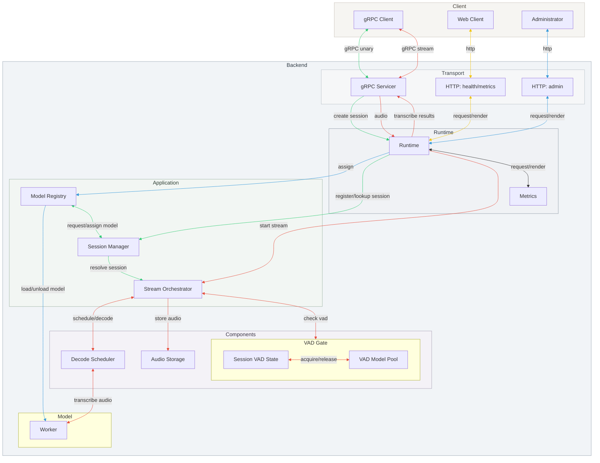

# Whisper Streaming STT Server

Whisper Streaming STT Server is a gRPC service that performs low-latency speech to text with VAD-based endpointing, streaming partial/final results as audio arrives.

## Overview

The client opens a gRPC channel, calls `CreateSession` to obtain the resolved session settings, then uses the bidirectional `StreamingRecognize` stream to send PCM chunks and receive partial/final transcripts. The server resolves the session, gates audio with VAD, schedules decodes, and optionally persists audio; session teardown handles cleanup and retention.

The gRPC servicer is the transport entrypoint and delegates both session creation and streaming audio to the runtime. The runtime wires the session manager, model registry, and stream orchestrator, while the orchestrator drives VAD, decode scheduling, and optional audio storage. The HTTP server queries runtime health for `/health` and renders metrics output for `/metrics` (Prometheus) and `/metrics.json` (JSON). It also exposes an admin control plane for runtime model management (e.g., loading, unloading, and listing Whisper models without restarting the server).



## Setup

PyAV (a transitive dependency of `faster-whisper`) requires `pkg-config` so it can find FFmpeg headers during installation. Install the system packages first, then run `pip install -r requirements.txt`.

### macOS

```bash
brew install pkg-config ffmpeg
```

> **Note:** PyAV 11.x (required by `faster-whisper==0.10.0`) is not compatible
> with FFmpeg 7/8 headers yet; build failures usually mention
> `AV_OPT_TYPE_CHANNEL_LAYOUT`. Install FFmpeg 6 instead:
>
> ```bash
> brew uninstall --ignore-dependencies ffmpeg
> brew install ffmpeg@6
> brew link --overwrite --force ffmpeg@6
> ```

### Debian/Ubuntu

```bash
sudo apt update
sudo apt install pkg-config ffmpeg libavformat-dev libavcodec-dev libavdevice-dev
```

## Generate gRPC stubs

Create a versioned package structure (e.g. `gen/stt/python/v1`) so both the server and client can import the same generated stubs:

```bash
mkdir -p gen/stt/python/v1
touch gen/__init__.py
touch gen/stt/__init__.py
touch gen/stt/python/__init__.py
touch gen/stt/python/v1/__init__.py

python -m grpc_tools.protoc \
  -I proto \
  --python_out=gen/stt/python/v1 \
  --grpc_python_out=gen/stt/python/v1 \
  --mypy_out=./gen/stt/python/v1 \
  proto/stt.proto
```

Commit/publish the `gen` package (or copy it into each project) so both
sides share the same `stt_pb2.py` and `stt_pb2_grpc.py` files.

## Configuration

Runtime defaults live in two files:

- `config/server.yaml`: networking, session limits, logging, and VAD controls.
- `config/model.yaml`: Whisper model/device settings plus the named decode profiles.

Sample client configs live in:

- `stt_client/config/file.yaml`: file + batch client defaults (audio path, session options).
- `stt_client/config/mic.yaml`: mic client defaults (device, sample rate, session options).

Copy/edit the server YAMLs (or point `--config` / `--model-config` at your own YAML) to change server behavior. Client YAMLs are loaded via `-c/--config`. Example server snippet (`config/server.yaml`):

```yaml
server:
  port: 50051
  max_sessions: 4
  metrics_port: 8000
  decode_timeout_sec: 30
  log_metrics: false
  session_timeout_sec: 60
  max_buffer_sec: 20
  max_buffer_bytes: null
  max_chunk_ms: 2000
  partial_decode_interval_sec: 1.5
  partial_decode_window_sec: 10.0
  max_pending_decodes_per_stream: 8
  max_pending_decodes_global: 64
  max_total_buffer_bytes: 67108864
  decode_queue_timeout_sec: 1.0
  buffer_overlap_sec: 0.5
  grpc_max_receive_message_bytes: 8388608
  grpc_max_send_message_bytes: 4194304
  sample_rate: 16000

vad:
  silence: 0.5
  threshold: 0.5
  model_pool_size: 4
  model_prewarm: 1
  model_pool_growth_factor: 1.5

safety:
  speech_rms_threshold: 0.00

logging:
  level: "INFO"
  file: null
  faster_whisper_level: null # Optional override (default WARNING when unset)

metrics:
  expose_api_key_sessions: false

storage:
  persist_audio: false
  directory: "data/audio"
  queue_max_chunks: 256 # Max queued PCM chunks before dropping oldest
  max_bytes: null # Optional byte cap
  max_files: null # Optional file-count cap
  max_age_days: null # Optional retention window

health:
  window_sec: 60 # Rolling window for decode health aggregation
  min_events: 5 # Minimum events before evaluating health ratios
  max_timeout_ratio: 0.5 # Degraded when decode timeouts exceed this ratio
  min_success_ratio: 0.5 # Degraded when successful decodes fall below this ratio
```

Example model snippet (`config/model.yaml`):

```yaml
model:
  name: "small" # Whisper model size
  device: "cpu" # cpu / cuda
  compute_type: "int8" # faster-whisper compute type
  pool_size: 1 # Number of preloaded model instances
  language_fix: false
  language: "ko" # e.g., de, en, fr, ja, ko, zh ...
  task: "transcribe" # "transcribe" | "translate"
  default_decode_profile: "realtime"

decode_profiles:
  realtime:
    beam_size: 1
    best_of: 1
    patience: 1.0
    temperature: 0.0
    length_penalty: 1.0
    without_timestamps: true
    compression_ratio_threshold: 2.4
    no_speech_threshold: 0.6
    log_prob_threshold: -1.0 # Low-probability rejection threshold (-1.0 disables)
  accurate:
    beam_size: 5
    best_of: 5
    patience: 1.0
    temperature: 0.0
    length_penalty: 1.0
    without_timestamps: true
    compression_ratio_threshold: 2.4
    no_speech_threshold: 0.6
    log_prob_threshold: -1.0
```

CLI flags always override YAML entries if provided.
`model.languages` defines one or more languages to force during decoding (repeat entries to weight certain languages or set to `null`/omit to let Whisper auto-detect). `model.pool_size` controls how many Whisper model instances are preloaded (akin to license count); `server.max_sessions` caps concurrent gRPC streams. `vad.model_pool_size` / `vad.model_prewarm` control the Silero VAD model reuse pool and startup prewarming (`model_pool_size=0` uses `server.max_sessions`); when demand exceeds the configured VAD pool, the pool expands by `vad.model_pool_growth_factor` up to `server.max_sessions`, after which new sessions are rejected with `ERR1008` to avoid overflow loading. The `server.decode_timeout_sec` value controls how long the server waits for a decode task when draining pending work (set to a non-positive value to wait forever). `server.max_buffer_sec` / `server.max_buffer_bytes` cap buffered audio to prevent unbounded growth; when the limit is reached, VAD Continue schedules a partial decode and retains `server.buffer_overlap_sec`, while VAD Auto-End keeps only the most recent audio window. `server.partial_decode_interval_sec` controls how often partial decodes are scheduled while speech is active, and `server.partial_decode_window_sec` caps the audio window sent for those partial decodes. `server.max_chunk_ms` caps the maximum single audio chunk duration to guard against oversized messages. `server.max_pending_decodes_per_stream` bounds queued decodes per stream; `server.max_pending_decodes_global` enforces a server-wide cap with backpressure for finals and drops for partials. `server.max_total_buffer_bytes` caps total buffered audio across all sessions. `server.decode_queue_timeout_sec` controls how long finals wait for a global decode slot. `server.grpc_max_receive_message_bytes` / `server.grpc_max_send_message_bytes` cap gRPC message sizes. `metrics.expose_api_key_sessions` controls whether `/metrics` includes `active_sessions_by_api`. `storage.queue_max_chunks` bounds the audio capture queue (oldest chunks are dropped when full). The `health.*` thresholds tune how `/health` evaluates recent decode success and timeout ratios. The `safety.speech_rms_threshold` setting helps filter out low level noise by requiring buffered audio to exceed the given RMS before decoding.

Each client first calls `CreateSession`, passing an application-defined `session_id` plus optional `--attr KEY=VALUE` pairs (custom session attributes, `--meta` remains as a CLI alias). They can also request either **VAD Continue** (default) or **VAD Auto-End** via the `--vad-mode` flag; auto-end terminates the session once silence is detected, while continue keeps the session alive for multi-utterance workloads. Use `--require-token` if you want the server to issue a per-session token that must be attached to every audio chunk for light-weight validation. Sessions are cleaned up automatically when the streaming RPC ends.

## Observability

The server also exposes an HTTP control plane (default `0.0.0.0:8000`) serving:

- `GET /metrics`: Prometheus text exposition (flattened counters/gauges).
- `GET /metrics.json`: JSON counters/gauges (active sessions, API-key session counts, decode timing aggregates, RTF stats, VAD trigger totals, active VAD utterances, error counts).
- `GET /health`: returns `200` when the gRPC server is running, Whisper models are loaded, and worker pools are healthy; otherwise `500`.
- `GET /system`: JSON process/system metrics (CPU, RAM, thread counts). Uses `psutil` when available; otherwise falls back to basic RSS info. Optional GPU metrics can be enabled with `STT_ENABLE_GPU_METRICS=1` when `pynvml` is installed.

### Terminal dashboard (optional)

Use the terminal dashboard to poll `/metrics.json` and `/system` on a fixed interval:

```bash
python -m tools.dashboard.monitor_dashboard
```

Common options:

- `--metrics-url` / `--system-url` to target a remote server.
- `--interval` to control refresh cadence (seconds).
- `--once` to fetch a single snapshot.
- `--no-clear` to avoid clearing the terminal between updates.

### Decode timing breakdown

Decode timing is measured inside the server for every decode task. The timing is split into distinct phases so you can see where time is being spent:

- **buffer wait time**: time spent accumulating audio before the decode is scheduled
- **queue wait time**: time spent waiting for an available model worker after the decode is scheduled
- **inference time**: time spent executing the model
- **response emit time**: time spent yielding results back to the client
- **total decode time**: sum of buffer wait + queue wait + inference + response emit


These totals are attached to each `StreamingRecognize` call as trailing metadata:

- `stt-decode-buffer-wait-sec`
- `stt-decode-queue-wait-sec`
- `stt-decode-inference-sec`
- `stt-decode-response-emit-sec`
- `stt-decode-total-sec`
- `stt-decode-count`

The `sec` suffix means seconds. Bench session logs print the same values per stream to help correlate client-observed latency with server-side decode timing.

## Admin (Control Plane)

The server provides an HTTP-based admin control plane for **runtime model management**.
These endpoints allow operators to manage Whisper models without restarting the gRPC server.

### Endpoints

- `POST /admin/load_model`
  Loads a Whisper model into the runtime. This can be used to pre-warm models or dynamically add new model variants.

- `POST /admin/unload_model`
  Unloads a previously loaded model to free CPU/GPU memory. Active sessions using the model must complete or fail gracefully.

- `GET /admin/list_models`
  Returns the list of currently loaded models and their runtime status.

**Note:** Admin endpoints are intended for operator use only and should be protected or restricted in production environments.

### Admin API security (recommended)

Admin endpoints are **disabled by default**. To enable them, set:

- `STT_ADMIN_ENABLED=true`
- `STT_ADMIN_TOKEN=<token>`

Requests must include an `Authorization: Bearer <token>` header.

To restrict model loading via `model_path`, set:

- `STT_ADMIN_ALLOW_MODEL_PATH=true` to allow `model_path`
- `STT_ADMIN_MODEL_PATH_ALLOWLIST` (comma-separated prefixes) to whitelist paths/IDs
  - Examples: `/models/`, `openai/`

## Assets

- `stt_client/assets/hello.wav`: sourced from https://github.com/SkelterLabsInc/stt-dataset-example

## Error codes

Errors are tagged in logs and gRPC error messages with `ERR####`. HTTP endpoints (admin/control plane) return a JSON payload with `code` and `message` when they fail. The gRPC status codes are listed below for clarity.

- `ERR1xxx`: request/session validation or authentication failures
- `ERR2xxx`: decode pipeline/runtime failures
- `ERR3xxx`: unexpected server exceptions
- `ERR4xxx`: admin/control-plane HTTP failures

- `ERR1001` (INVALID_ARGUMENT): missing `session_id` in `CreateSession`
- `ERR1002` (ALREADY_EXISTS): `session_id` already active
- `ERR1003` (INVALID_ARGUMENT): `vad_threshold` must be non-negative
- `ERR1004` (UNAUTHENTICATED): unknown or missing `session_id`
- `ERR1005` (PERMISSION_DENIED): invalid session token
- `ERR1006` (DEADLINE_EXCEEDED): session timeout (no audio)
- `ERR1007` (INVALID_ARGUMENT): audio chunk exceeds maximum size
- `ERR1008` (RESOURCE_EXHAUSTED): VAD capacity exhausted
- `ERR1009` (UNAUTHENTICATED): API key required but missing
- `ERR1010` (INVALID_ARGUMENT): invalid decode option(s)
- `ERR2001` (INTERNAL): decode timeout waiting for pending tasks
- `ERR2002` (INTERNAL): decode task failed
- `ERR3001` (UNKNOWN): unexpected `CreateSession` error
- `ERR3002` (UNKNOWN): unexpected `StreamingRecognize` error
- `ERR4001` (HTTP 501): admin API not enabled
- `ERR4002` (HTTP 409): model already loaded
- `ERR4003` (HTTP 400): model not found or is default (unload failed)
- `ERR4004` (HTTP 401): invalid or missing admin token
- `ERR4005` (HTTP 403): `model_path` not allowed

## Run

1. Install dependencies (after the system packages above):
   ```bash
   python -m venv .venv
   source .venv/bin/activate
   python -m pip install -r requirements.txt
   ```
2. Start the gRPC server (run from the repo root so `gen` is on `PYTHONPATH`):

```bash
python -m stt_server.main --log-metrics
```

- `--model`, `--device`, `--compute-type`, `--language`, `--model-pool-size`,
  and `--port` let you customize faster-whisper instances and networking.
- `--max-sessions` controls how many client streams the server accepts in parallel.
- `--log-metrics` prints decode latency + real-time factor for each decode run.
- `--config <path>` points to the server YAML (default: `config/server.yaml`).
- `--model-config <path>` points to the model/decode YAML (default: `config/model.yaml`).
- `--log-level` / `--log-file` override the logging section (console/file).
- `--faster-whisper-log-level` overrides the `faster_whisper` logger level (default WARNING).
- `--vad-silence` / `--vad-threshold` configure the VAD gate (silence duration +
  Silero VAD probability threshold, 0-1) that triggers final decoding.
- `--speech-threshold` sets the minimum RMS required before buffering is treated
  as speech (helps ignore low-level noise).
- `--decode-timeout` specifies the wait time for outstanding decode tasks
  during draining (<=0 waits indefinitely).
- `--metrics-port` sets the FastAPI metrics/health server port (default 8000).
- Sessions auto-disconnect after 60 seconds of silence; adjust `server.session_timeout_sec` in `config/server.yaml` (or set your own config file).

3. In another terminal, run the sample **realtime file** client:

   ```bash
   python -m stt_client.realtime.file -c stt_client/config/file.yaml --metrics
   ```

   - `-c/--config` loads YAML defaults (e.g., `audio_path`, `decode_profile`, VAD settings). CLI flags override.
   - Add `--no-realtime` to send audio as fast as possible (for throughput tests).
   - Use `--server host:port` or `--chunk-ms value` to tweak target and chunking.
   - Use `--vad-mode auto` to enable auto-end sessions (default is `continue`).
   - Override the detector per session via `--vad-silence` (seconds) and `--vad-threshold` (VAD probability).
   - Use `--language ja`, `--task translate`, or `--decode-profile accurate` to
     override the server defaults per session.
   - `--attr key=value` (repeatable) attaches arbitrary attributes, and
     `--require-token` asks the server to issue/validate per-session tokens.

4. To stream live audio from a macOS microphone (requires microphone permission):

   ```bash
   python -m stt_client.realtime.mic -c stt_client/config/mic.yaml --metrics
   ```

   - Defaults to `--vad-mode continue`; use `auto` to end sessions once speech stops.
   - Per-session overrides: `--vad-silence` (seconds) and `--vad-threshold` (VAD probability) mirror the server flags.
   - Same `--language`, `--task`, `--decode-profile`, `--require-token`, and attributes semantics apply.
   - Optional flags: `--device` (CoreAudio name/index), `--sample-rate`, `--chunk-ms`.

5. For batch-style processing (single large chunk, ideal for accuracy-oriented profiles):

   ```bash
   python -m stt_client.batch.file -c stt_client/config/file.yaml --decode-profile accurate
   ```

   - Defaults to the `accurate` profile; override with `--decode-profile realtime`.
   - Accepts the same `--language`, `--task`, attributes, token, and `--vad-*` flags as the realtime clients.
   - Batch ignores `chunk_ms`/`realtime` fields in the config; it always sends a single chunk.

## Load testing (bench)

Run the gRPC load-test script from the repo root:

```bash
python -m tools.bench.grpc_load_test --channels 100 --iterations 1 --warmup-iterations 1 --log-sessions
```

Per-session logs can be emitted in structured formats:

- `--session-log-format` supports `jsonl` (default), `csv`, `tsv`, and `markdown`.
- `--log-sessions` prints per-session logs to stdout (limited by `--max-session-logs`).
- `--session-log-path <path>` writes **all** session logs to a file using the selected format.
- `--warmup-iterations` runs warm-up iterations per channel that are excluded from the stats.
- `--ramp-steps` / `--ramp-interval-sec` ramp channels up in batches instead of firing all at once.

The per-session fields include the decode timing breakdown (`decode_buffer_wait_seconds`, `decode_queue_wait_seconds`, `decode_inference_seconds`, `decode_response_emit_seconds`, `decode_total_seconds`). Durations are rounded to three decimal places. Markdown output includes a header, start/end time, and column definitions; CSV/TSV/JSONL outputs contain only data rows.

## Docker

Dockerfiles live in the `docker/` directory (Ubuntu 22.04).

Build:

```bash
docker build -f docker/Dockerfile.ubuntu -t whisper-stt-server:ubuntu .
```

Run:

```bash
docker run --rm -p 50051:50051 -p 8000:8000 whisper-stt-server:ubuntu
```

### Kubernetes

Apply manifests (ConfigMap, Deployment, Service):

```bash
kubectl apply -f k8s/configmap.yaml
kubectl apply -f k8s/deployment.yaml
kubectl apply -f k8s/service.yaml
```

NodePort access (on-premises):

```bash
kubectl get nodes -o wide

# Use the Internal-IP value from `kubectl get nodes -o wide` for <node-internal-ip>.
python -m stt_client.realtime.mic --server <node-internal-ip>:32051
```

Update config and rollout:

```bash
kubectl apply -f k8s/configmap.yaml
kubectl rollout restart deployment/stt-server
```

## Server-side audio capture

Enable `storage.persist_audio: true` to have the backend archive one WAV file per session inside `storage.directory`. Audio chunks are queued to a background writer thread to avoid blocking the streaming loop. Retention is enforced lazily right after each session finishes:

- `max_bytes`: cap total on-disk bytes (oldest files removed first).
- `max_files`: keep at most _N_ WAV files (oldest deleted first).
- `max_age_days`: delete recordings older than _N_ days.

Leave any limit `null` or negative for “no limit”. Audio capture is disabled by default and only activates when configured, so deployments that do not need server-side logging incur no overhead.
