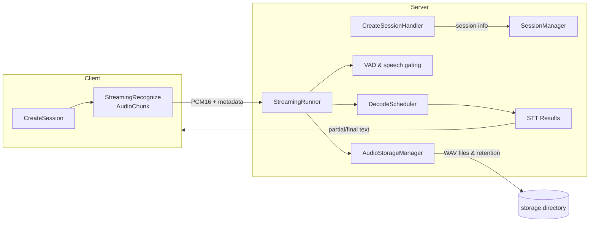

## Setup

PyAV (a transitive dependency of `faster-whisper`) requires `pkg-config` so it can
find FFmpeg headers during installation. Install the system packages first, then
run `pip install -r requirements.txt`.

### macOS

```bash
brew install pkg-config ffmpeg
```

> **Note:** PyAV 11.x (required by `faster-whisper==0.10.0`) is not compatible
> with FFmpeg 7/8 headers yet; build failures usually mention
> `AV_OPT_TYPE_CHANNEL_LAYOUT`. Install FFmpeg 6 instead:
>
> ```bash
> brew uninstall --ignore-dependencies ffmpeg
> brew install ffmpeg@6
> brew link --overwrite --force ffmpeg@6
> ```

### Debian/Ubuntu

```bash
sudo apt update
sudo apt install pkg-config ffmpeg libavformat-dev libavcodec-dev libavdevice-dev
```

## Generate gRPC stubs

Create a versioned package structure (e.g. `gen/stt/python/v1`) so both the
server and client can import the same generated stubs:

```bash
mkdir -p gen/stt/python/v1
touch gen/__init__.py
touch gen/stt/__init__.py
touch gen/stt/python/__init__.py
touch gen/stt/python/v1/__init__.py

python -m grpc_tools.protoc \
  -I proto \
  --python_out=gen/stt/python/v1 \
  --grpc_python_out=gen/stt/python/v1 \
  --mypy_out=./gen/stt/python/v1 \
  proto/stt.proto
```

Commit/publish the `gen` package (or copy it into each project) so both
sides share the same `stt_pb2.py` and `stt_pb2_grpc.py` files.

## Configuration

Runtime defaults live in two files:

- `config/server.yaml`: networking, session limits, logging, and VAD controls.
- `config/model.yaml`: Whisper model/device settings plus the named decode profiles.

Copy/edit these files (or point `--config` / `--model-config` at your own YAML) to
change behavior without touching code. Example server snippet (`config/server.yaml`):

```yaml
server:
  port: 50051
  max_sessions: 4
  metrics_port: 8000
  decode_timeout_sec: 30
  log_metrics: false
  session_timeout_sec: 60
  sample_rate: 16000

vad:
  silence: 0.5
  threshold: 0.5

safety:
  speech_rms_threshold: 0.00

logging:
  level: "INFO"
  file: null

storage:
  persist_audio: false
  directory: "data/audio"
  max_bytes: null # Optional byte cap
  max_files: null # Optional file-count cap
  max_age_days: null # Optional retention window
```

Example model snippet (`config/model.yaml`):

```yaml
model:
  name: "small" # Whisper model size
  device: "cpu" # cpu / cuda
  compute_type: "int8" # faster-whisper compute type
  pool_size: 1 # Number of preloaded model instances
  language_fix: false
  language: "ko" # e.g., de, en, fr, ja, ko, zh ...
  task: "transcribe" # "transcribe" | "translate"
  default_decode_profile: "realtime"

decode_profiles:
  realtime:
    beam_size: 1
    best_of: 1
    patience: 1.0
    temperature: 0.0
    length_penalty: 1.0
    without_timestamps: true
    compression_ratio_threshold: 2.4
    no_speech_threshold: 0.6
    log_prob_threshold: -1.0 # Low-probability rejection threshold (-1.0 disables)
  accurate:
    beam_size: 5
    best_of: 5
    patience: 1.0
    temperature: 0.0
    length_penalty: 1.0
    without_timestamps: true
    compression_ratio_threshold: 2.4
    no_speech_threshold: 0.6
    log_prob_threshold: -1.0
```

CLI flags always override YAML entries if provided.
`model.languages` defines one or more languages to force during decoding
(repeat entries to weight certain languages or set to `null`/omit to let Whisper
auto-detect). `model.pool_size` controls how many Whisper model instances are
preloaded (akin to license count); `server.max_sessions` caps concurrent gRPC
streams. The `server.decode_timeout_sec` value controls how long the server
waits for a decode task when draining pending work (set to a non-positive value
to wait forever). The `safety.speech_rms_threshold` setting helps filter out low
level noise by requiring buffered audio to exceed the given RMS before decoding.

Each client first calls `CreateSession`, passing an application-defined
`session_id` plus optional `--attr KEY=VALUE` pairs (custom session attributes, `--meta`
remains as a CLI alias). They can also request
either **VAD Continue** (default) or **VAD Auto-End** via the `--vad-mode` flag;
auto-end terminates the session once silence is detected, while continue keeps
the session alive for multi-utterance workloads. Use `--require-token` if you
want the server to issue a per-session token that must be attached to every
audio chunk for light-weight validation. Sessions are cleaned up automatically
when the streaming RPC ends.

## Observability

The server also exposes an HTTP control plane (default `0.0.0.0:8000`) serving:

- `GET /metrics`: plain-text counters/gauges (active sessions, API-key session
  counts, decode latency aggregates, RTF stats, VAD trigger totals, active VAD
  utterances, error counts) that can be scraped or converted to Prometheus
  format later.
- `GET /health`: returns `200` when the gRPC server is running, Whisper models
  are loaded, and worker pools are healthy; otherwise `500`.

## Run

1. Install dependencies (after the system packages above):
   ```bash
   python -m venv .venv
   source .venv/bin/activate
   python -m pip install -r requirements.txt
   ```
2. Start the gRPC server (run from the repo root so `gen` is on `PYTHONPATH`):

```bash
python -m stt_server.main --log-metrics
```

- `--model`, `--device`, `--compute-type`, `--language`, `--model-pool-size`,
  and `--port` let you customize faster-whisper instances and networking.
  let you customize faster-whisper instances and networking.
- `--max-sessions` controls how many client streams the server accepts in parallel.
- `--log-metrics` prints decode latency + real-time factor for each decode run.
- `--config <path>` points to the server YAML (default: `config/server.yaml`).
- `--model-config <path>` points to the model/decode YAML (default: `config/model.yaml`).
- `--log-level` / `--log-file` override the logging section (console/file).
- `--vad-silence` / `--vad-threshold` configure the VAD gate (silence duration +
  Silero VAD probability threshold, 0-1) that triggers final decoding.
- `--speech-threshold` sets the minimum RMS required before buffering is treated
  as speech (helps ignore low-level noise).
- `--decode-timeout` specifies the wait time for outstanding decode tasks
  during draining (<=0 waits indefinitely).
- `--metrics-port` sets the FastAPI metrics/health server port (default 8000).
- Sessions auto-disconnect after 60 seconds of silence; adjust in code if needed.

3. In another terminal, run the sample **realtime file** client:
   ```bash
   python -m stt_client.realtime.file path/to/audio.wav --metrics
   ```
   - Add `--no-realtime` to send audio as fast as possible (for throughput tests).
   - Use `--server host:port` or `--chunk-ms value` to tweak target and chunking.
   - Use `--vad-mode auto` to enable auto-end sessions (default is `continue`).
   - Override the detector per session via `--vad-silence` (seconds) and `--vad-threshold` (VAD probability).
   - Use `--language ja`, `--task translate`, or `--decode-profile accurate` to
     override the server defaults per session.
   - `--attr key=value` (repeatable) attaches arbitrary attributes, and
     `--require-token` asks the server to issue/validate per-session tokens.
4. To stream live audio from a macOS microphone (requires microphone permission):
   ```bash
   python -m stt_client.realtime.mic --metrics
   ```
   - Defaults to `--vad-mode auto` so sessions end automatically once speech stops;
     switch to `continue` if you need multi-utterance streaming.
   - Per-session overrides: `--vad-silence` (seconds) and `--vad-threshold` (VAD probability) mirror the server flags.
   - Same `--language`, `--task`, `--decode-profile`, `--require-token`, and attributes semantics apply.
   - Optional flags: `--device` (CoreAudio name/index), `--sample-rate`, `--chunk-ms`.
5. For batch-style processing (single large chunk, ideal for accuracy-oriented profiles):
   ```bash
   python -m stt_client.batch.file path/to/audio.wav --decode-profile accurate
   ```
   - Defaults to the `accurate` profile; override with `--decode-profile realtime`.
   - Accepts the same `--language`, `--task`, attributes, token, and `--vad-*` flags as the realtime clients.

## Server-side audio capture

Enable `storage.persist_audio: true` to have the backend archive one WAV file
per session inside `storage.directory`. Retention is enforced lazily right after
each session finishes:

- `max_bytes`: cap total on-disk bytes (oldest files removed first).
- `max_files`: keep at most _N_ WAV files (oldest deleted first).
- `max_age_days`: delete recordings older than _N_ days.

Leave any limit `null` or negative for “no limit”. Audio capture is disabled by
default and only activates when configured, so deployments that do not need
server-side logging incur no overhead.

### Streaming pipeline overview



The streaming runner resolves the session, runs VAD/speech gating, schedules
decoding, and, when capture is enabled, streams the exact PCM bytes to the audio
storage manager. When the session ends (normal completion, timeout, disconnect,
or invalid token) the recorder finalizes its WAV file and the retention policy
purges the oldest files if necessary.
