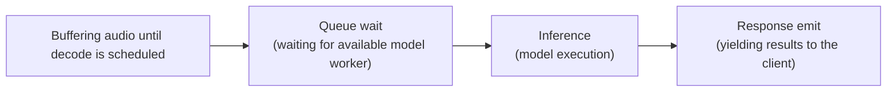

# Operations/Observability

The server also exposes an HTTP control plane (default `0.0.0.0:8000`) serving:

- `GET /metrics`: Prometheus text exposition (flattened counters/gauges).
- `GET /metrics.json`: JSON counters/gauges (active sessions, API-key session counts, decode timing aggregates, RTF stats, VAD trigger totals, active VAD utterances, error counts, buffer bytes, partial drop counts, rate-limit blocks).
- `GET /health`: returns `200` when the gRPC server is running, Whisper models are loaded, and worker pools are healthy; otherwise `500`.
- `GET /system`: JSON process/system metrics (CPU, RAM, thread counts). Uses `psutil` when available; otherwise falls back to basic RSS info. Optional GPU metrics can be enabled with `STT_ENABLE_GPU_METRICS=1` when `pynvml` is installed.

Backpressure health checklist (during load):

- `system.process.rss_bytes`: should stabilize after warmup (no unbounded climb).
- `metrics.decode_pending`: should plateau near the configured pending cap.
- `metrics.buffer_bytes_total`: should plateau near `max_total_buffer_bytes` when buffers are pressured.
- `metrics.partial_drop_count` / `metrics.rate_limit_blocks.*`: should increase when limits are actively shedding load.
- Dashboard and alerting suggestions live in `docs/slo.md`.

Security checks:

- `tools/security_smoke_check.sh http://<host>:<port>` verifies `/metrics*`, `/system`, `/health` are protected (or `/health` is minimal when `STT_PUBLIC_HEALTH=minimal`).
- `tools/check_tls_expiry.py /path/to/cert.pem --warn-days 14` fails when certificates near expiry.

## Terminal dashboard (optional)

Use the terminal dashboard to poll `/metrics.json` and `/system` on a fixed interval:

```bash
python -m tools.dashboard.monitor_dashboard
```

Capture metrics to a file (JSONL or CSV) for later graphing:

```bash
python -m tools.dashboard.metrics_capture --duration-sec 300 --out metrics.jsonl
```

Plot captured metrics (requires `matplotlib`):

```bash
python -m tools.dashboard.plot_metrics metrics.jsonl --relative --output metrics.png
```

Common options:

- `--metrics-url` / `--system-url` to target a remote server.
- `--interval` to control refresh cadence (seconds).
- `--once` to fetch a single snapshot.
- `--no-clear` to avoid clearing the terminal between updates.

## Decode timing breakdown

Decode timing is measured inside the server for every decode task. The timing is split into distinct phases so you can see where time is being spent:

- **buffer wait time**: time spent accumulating audio before the decode is scheduled
- **queue wait time**: time spent waiting for an available model worker after the decode is scheduled
- **inference time**: time spent executing the model
- **response emit time**: time spent yielding results back to the client
- **total decode time**: sum of buffer wait + queue wait + inference + response emit



These totals are attached to each `StreamingRecognize` call as trailing metadata:

- `stt-decode-buffer-wait-sec`
- `stt-decode-queue-wait-sec`
- `stt-decode-inference-sec`
- `stt-decode-response-emit-sec`
- `stt-decode-total-sec`
- `stt-decode-count`

The `sec` suffix means seconds. Bench session logs print the same values per stream to help correlate client-observed latency with server-side decode timing.

## Docker

Dockerfiles live in the `docker/` directory (Ubuntu 22.04).

Build:

```bash
docker build -f docker/Dockerfile.ubuntu -t whisper-stt-server:ubuntu .
```

Run:

```bash
docker run --rm -p 50051:50051 -p 8000:8000 whisper-stt-server:ubuntu
```

### Kubernetes

Apply manifests (ConfigMap, Deployment, Service):

```bash
kubectl apply -f k8s/configmap.yaml
kubectl apply -f k8s/deployment.yaml
kubectl apply -f k8s/service.yaml
```

NodePort access (on-premises):

```bash
kubectl get nodes -o wide

# Use the Internal-IP value from `kubectl get nodes -o wide` for <node-internal-ip>.
python -m stt_client.realtime.mic --server <node-internal-ip>:32051
```

Update config and rollout:

```bash
kubectl apply -f k8s/configmap.yaml
kubectl rollout restart deployment/stt-server
```

## Server-side audio capture

Enable `storage.persist_audio: true` to have the backend archive one WAV file per session inside `storage.directory`. Audio chunks are queued to a background writer thread to avoid blocking the streaming loop. Retention is enforced lazily right after each session finishes:

- `max_bytes`: cap total on-disk bytes (oldest files removed first).
- `max_files`: keep at most _N_ WAV files (oldest deleted first).
- `max_age_days`: delete recordings older than _N_ days.

Leave any limit `null` or negative for “no limit”. Audio capture is disabled by default and only activates when configured, so deployments that do not need server-side logging incur no overhead.
